### Steps to work the simulator 

1. Click on the simulator tab to start the simulation. A short overview of the experiment, including learning objectives, learning outcomes, and key principles employed, is provided. Users can read and understand the experiment before beginning the experiment process. After understanding the concepts clearly, click on the “Begin Experiment” button.

  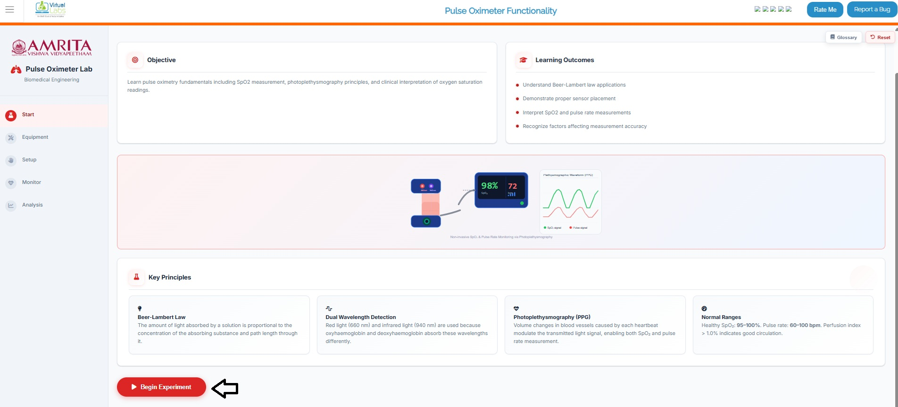

&nbsp;

2. The “Glossary” button provides a brief explanation of the theoretical concepts related to the experiment, while the “Reset” button returns the user to the initial stage of the simulator. These two buttons remain active throughout the simulation.

  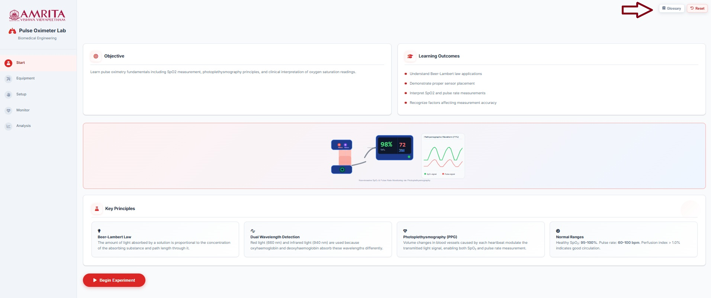

&nbsp;

3. Users can view and perform Equipment Familiarization. Click on each equipment component (Pulse oximeter device, sensor probe. LED light source and photodetector) to get a brief explanation of each component.

  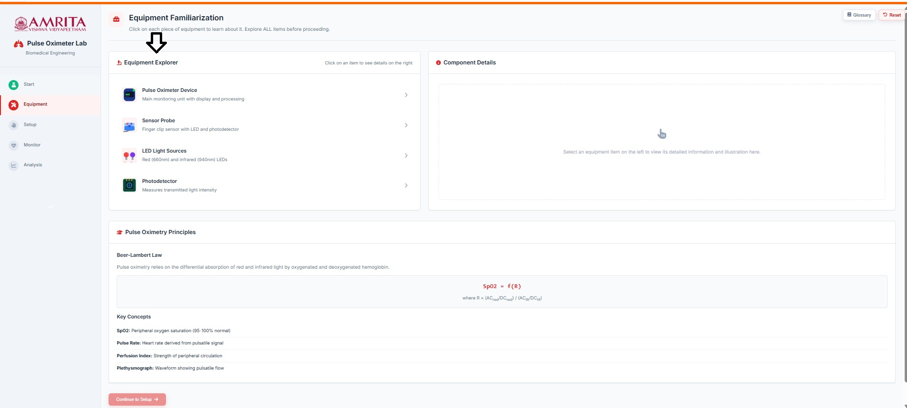

&nbsp;

4. When familiarized with each component, click on the “continue to setup” button to start working on the pulse oximeter. 

  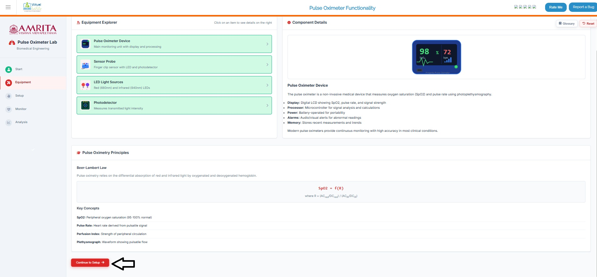

&nbsp;
 
5. The page will take the user to experiment setup page.  The guide to work out the simulator is provided there. Follow each step correctly to get accurate result. 

  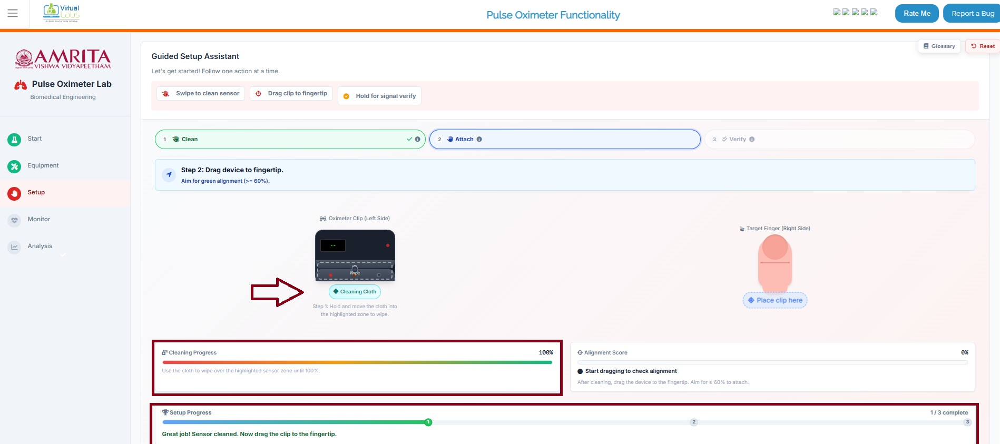

&nbsp;

6. The first step is to clean the pulse oximeter sensor. User can drag the button “cleaning cloth” to the area marked “Wipe” in the pulse oximeter. Hold and move the cloth until the “cleaning progress” bar reaches to 100%. That means it is cleaning properly for moving to next step. The setup progress will also be displayed in the simulator window. 

  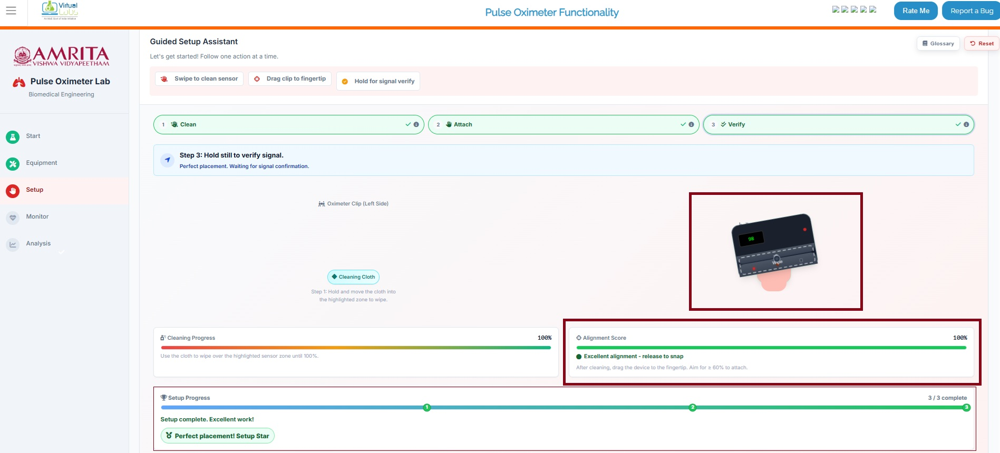

&nbsp;
 
7. The next step is to keep the pulse oximeter on the fingertip. For that drag the pulse oximeter to the  fingertip. The alignment score and the Setup Progress will be displayed in the simulator.

  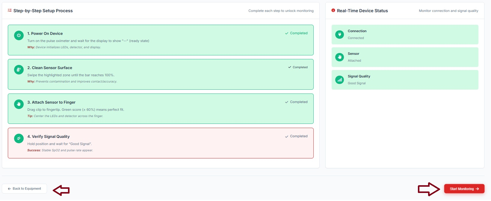

&nbsp;

8. User can observe the overview of the completed steps. User can click on Start monitoring button to move to the next step. If any clarifications were needed for the equipment setup, users can click on Back to Equipment. It will take the user to the equipment familiarization page. Then follow Step 3 to 7. 

  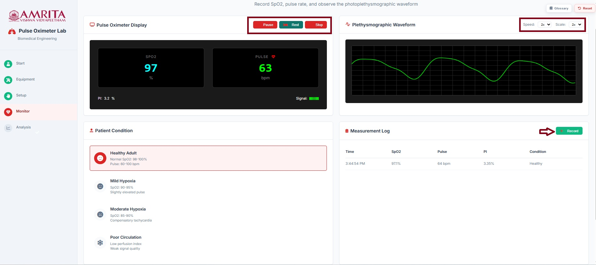

&nbsp;

9. When the user clicks on the “Start Monitoring” button, the page displays the SpO₂ value measured by the pulse oximeter along with the pulse rate, and the plethysmographic waveform. By clicking the “Record” button, parameters such as SpO₂, pulse rate, perfusion index (PI), time of recording, and subject condition are captured. Within the plethysmographic waveform display, the speed and scale can be adjusted. In the pulse oximeter interface, the user can also pause recording, enable the rest condition (allowing pulse rate and oxygen saturation to stabilize), and stop the recording as needed.

  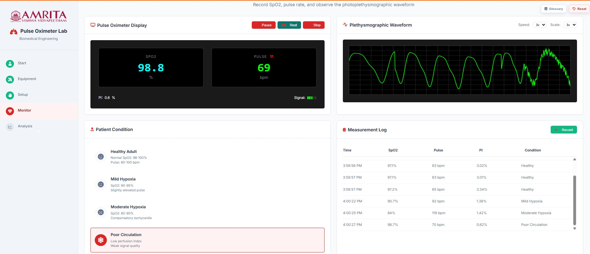

&nbsp;
 
10. While doing Step 8, users can change the subject condition and click on the Record button to get a deep understanding of the pulse oximeter during the analysis step.

  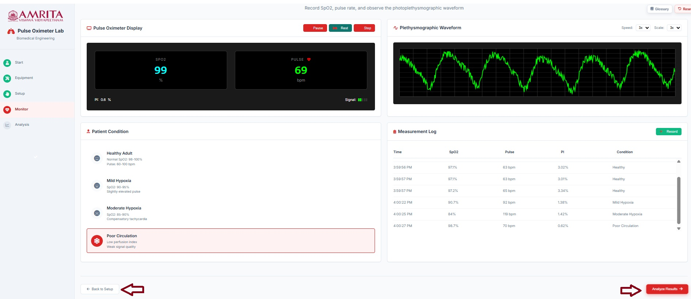

&nbsp;

11.	The user can then click on the “Analyze Result” button to initiate signal analysis. Alternatively, the “Back to Setup” option can be selected to revisit and better understand the previous steps if needed.   

  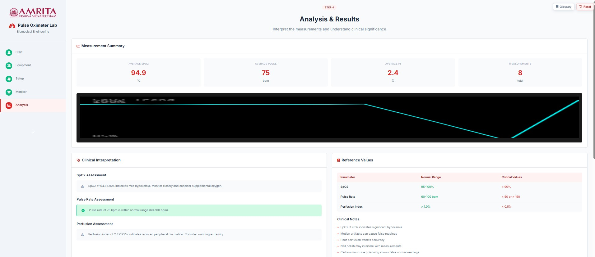

&nbsp;

12. The analysis page shows the summary of the measurements taken during the recording stage. The average SpO₂, average pulse rate, perfusion index (PI), and the total number of measurements recorded are displayed. Additionally, a clinical interpretation of these values is provided.

  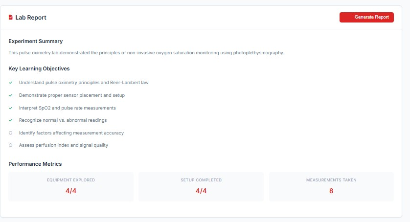

&nbsp;

13.	The user can then click on the “Generate Report” option to download the results of the simulation to their personal computer.

  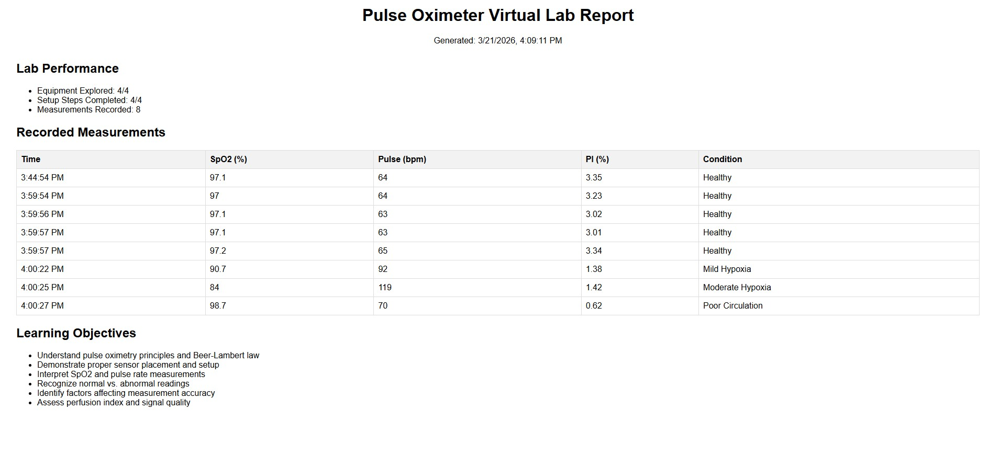

&nbsp;
 
14. The performance matrix is also displayed in the simulator window. The user can click on the “Complete Lab” tab to choose whether to download the results; this option provides an output similar to the “Generate Report” feature described in Steps 12.

  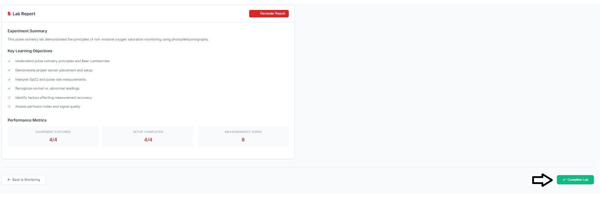

&nbsp;

15.	Clicking on the Back to monitor button takes the user to the monitoring page where the user can repeat steps 10, 11 and 12,13

  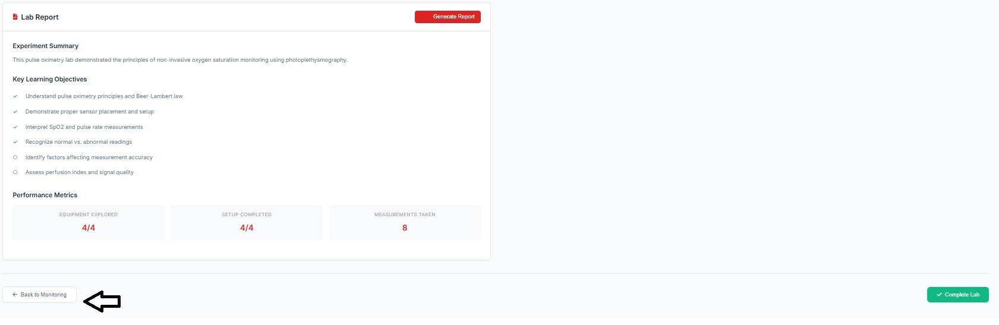

&nbsp;
