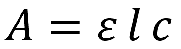
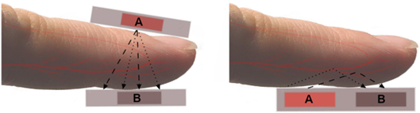
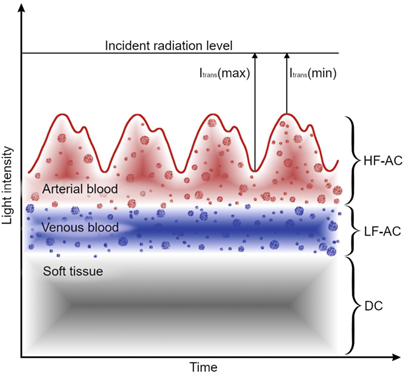

### Introduction
Oximetry refers to a medical diagnostic process that deals with blood oxygen levels. The pulse oximeter measures the amount of oxygen saturation in the blood. In biomedical engineering, understanding the operation of an oximeter is crucial for accurately interpreting pathology in clinical conditions, as it is considered a fifth vital sign. Oxygen saturation refers to how much haemoglobin is bound to oxygen compared to how much haemoglobin remains unbound. Haemoglobin containing oxygen is known as oxygenated haemoglobin, and haemoglobin without oxygen is called deoxygenated haemoglobin. Pulse oximetry, a non-invasive method that detects the oxygen saturation of haemoglobin in arterial blood, provides an early diagnosis for hypoxemia, an abnormally low concentration of oxygen in the arterial blood. This non-invasive method of pulse oximetry uses red and infrared light-emitting diodes (LEDs) to transmit light at different wavelengths and assess blood oxygen saturation. The absorption of red and infrared light is determined based on the type of haemoglobin present and its optical properties, where one wavelength is absorbed, and the other is transmitted. The transmitted light will be passed through the photo detector, where it is measured and processed to generate separate normalized signals for specific wavelengths. The proportion of oxygenated to deoxygenated haemoglobin is measured by the ratio of red-light measurement to the infrared light measurement, which is converted to SpO2 based on the Beer–Lambert law.

&nbsp;

### Theory
A pulse oximeter is developed for the measurement of peripheral blood oxygen saturation (SpO2). It is an optical technique that relies on the differential light absorption spectra of oxygenated (HbO2) and deoxygenated (HbR) haemoglobin. The pulse oximeter utilises the working principle of Photoplethysmography (PPG) to estimate SpO2 by measuring blood flow volume and evaluating physiological conditions in clinical cases. The normal range of SPO2  in healthy individuals is 95-100%. In pulse oximetry, the detection and quantification of components are based on light absorption characteristics, such as spectral analysis using the Beer–Lambert law. It states that the concentration of an absorbing substance in a solution is directly proportional to the amount of light absorbed, as quantified by measuring the intensity of the transmitted light at a specific wavelength.

&nbsp;
#### Mathematical Expression:
&nbsp;

  
   
  <i> Where: • A = Absorbance • ε = Molar extinction coefficient (characteristic absorbance) • l = Path length of light through the solution •	c = Concentration of the solution 

</i>

&nbsp;

It is widely used in spectrophotometry to determine unknown concentrations of substances.

&nbsp;

In general, the primary parameters measured by a pulse oximeter include: 

•**SpO₂** (Peripheral Oxygen Saturation), which helps in estimating oxygen-saturated haemoglobin percentage, relative to the total functional haemoglobin present in arterial blood.

•**PR** (Pulse Rate) indicates the number of heart beats per minute (BPM). Pulse rate obtained from the photoplethysmography (PPG) signal (using an LED and a photodetector) indicates cardiovascular activity and can be used to monitor heart rhythm and circulatory status.

•**PI** (Perfusion Index), which represents the ratio of pulsatile blood flow to non-pulsatile (static) blood flow in peripheral tissues.

&nbsp;

When the light from a pulse oximeter passes through a vascular tissue such as a fingertip, some light will be absorbed by the blood, and some light will be transmitted and sensed by a detector called a photodetector (Figure 1).

  
   Figure 1: Methods to obtain photoplethysmography (PPG) and oxygen saturation signals using a pulse oximeter 
  <i> Source: Leppänen, T., Kainulainen, S., Korkalainen, H., Sillanmäki, S., Kulkas, A., Töyräs, J., & Nikkonen, S. (2022). Pulse oximetry: the working principle, signal formation, and applications. In Advances in the Diagnosis and Treatment of Sleep Apnea: Filling the Gap Between Physicians and Engineers (pp. 205-218). 

</i>

That is, light penetrates the skin and reaches a sensor that can detect the changes in absorption of the two wavelengths of light. This change in light absorption due to a cardiac cycle will generate a pulsating waveform called a PPG waveform that represents blood volume in arteries. Oxygenated haemoglobin (HbO₂) and deoxygenated haemoglobin (HbR) absorb light differently at specific wavelengths, particularly in the red (660 nm) and infrared (940 nm) regions. The absorbance ratio at these wavelengths is calculated against direct measurements of arterial oxygen saturation levels (SaO2) to correlate the pulse oximeter reading with arterial oxygen saturation levels (SpO2)(Figure 2). 

  
   Figure 2: Light absorbance spectra for haemoglobin species 
  <i> Source: Source: Jubran, A. (2015). Pulse oximetry. Critical care, 19(1), 272. 

</i>

&nbsp;

The waveforms obtained from the pulse oximeter help clinicians distinguish an artefact and the true signal (Figure 3).  The light sensors can be placed either on a fingertip or earlobe. The response time of oximeter probes varies; ear probes respond more quickly to a change in blood oxygen saturation than finger probes. In newborns, the sensors are attached to a toe. 

  
   Figure 3.  Formation and waveform of the photoplethysmography signal 

</i>

&nbsp;

### Clinical applications of the pulse oximeter

• Detecting early symptoms of hypoxemia, the low concentration of oxygen in arterial blood.

• During cardiopulmonary exercise testing (CPET), pulse oximeter measurements were taken to continuously monitor oxygen saturation and pulse rate.

• Used to monitor oxygenation in conditions such as acute lung injury (ALI) and acute respiratory distress syndrome (ARDS), for evaluating a patient’s oxygen saturation status.

• Real-time detection of episodic and prolonged oxygen desaturation in surgery processes. 
